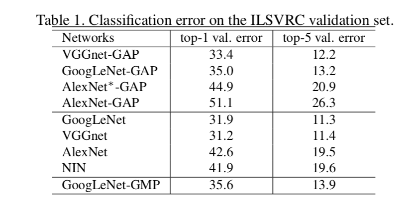
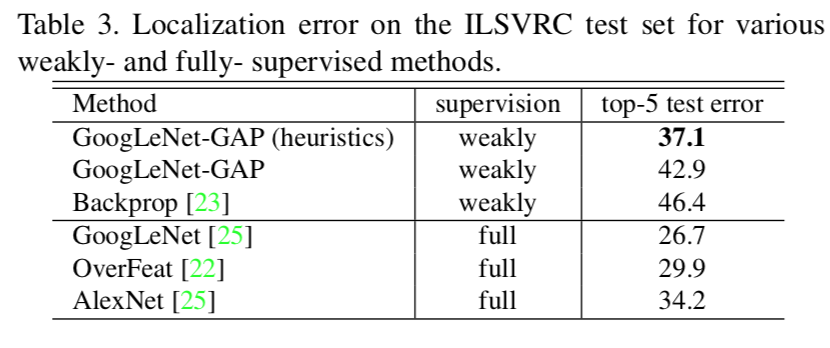

# 论文阅读笔记：Learning Deep Features for Discriminative Localization
## Introduction
### Task
基于弱监督学习的图像分类和定位(检测)
相关工作:
	* 弱监督目标定位
	* 可视化CNN

## Method
### Class Activation Mapping(CAM)
CAM技术详细且简洁地展示了如何用CNN进行目标定位(检测)以及可视化，原理很简单，主要基于**global average pooling(GAP)**

- Firstly, get the last convolutional layer feature maps $f_k(x,y)$，is the $kth$ channel feature map, channel num is $n$
- Sencondly，use **global average pooling** to get $F_{k}$

$$F_{k} = \sum_{x,y} f_k(x,y)$$
- Thirdly，use a FC layer，get class score $S_{c}$，it can be used to compute *softmax cross entropy loss* and then to train
$$S_{c} = \sum_{k}w^{c}_{k} * F_{k}$$

- Finally，we can get *class activation map* by the weights $w_{k}^{c}$ for every class $c$，the resolution of $M_c(x,y)$ and $f_k(x,y)$ is same, and we can *upsample* it to get final map(size is same with oral image)
$$M_c(x,y) = \sum_{k}w^{c}_{k}*f_{k}(x,y)$$

## Experiments
### classification result

Compared with original network(VGG、GoogleLeNet et al)，use GAP there is a small drop of 1%-2%.

### Localization

Compared with fully-supervised methods，use CAM there is a large difference，at last this method not use bounding box.

## Conclusion
* It is important that we can use classification-trained CNNs to learn to localization，without using any bounding box.
* The *class activation mapping* method is easy to transfer to other task for example captioning、VAQ et al.
