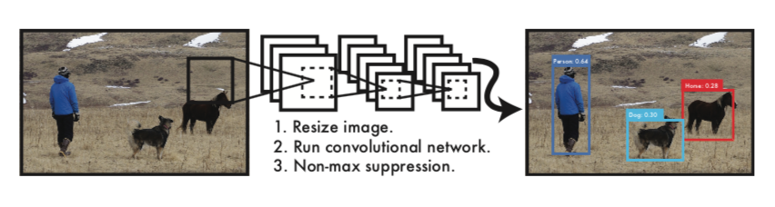
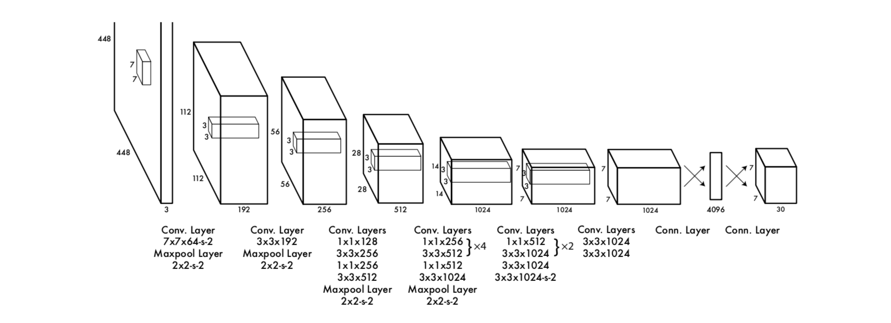
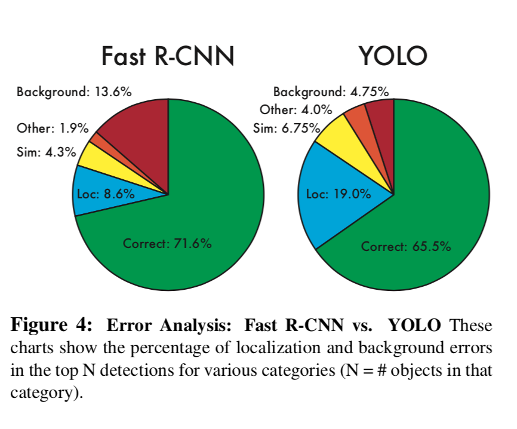

# 论文阅读笔记：You Only Look Once: Unified, Real-Time Object Detection

## Introduce
目标检测，找出图像中物体的位置及类别(定位和分类)。
- 常见的目标检测模型
	- DPM(Deformable Parts Models)：基于滑动窗口的目标检测模型
	- R-CNN：基于Region Proposed技术的目标检测模型，精度高，速度慢
	- YOLO：这篇论文的目标检测模型，精度达不到state of art

- YOLO模型的特点
	- 速度极快
	YOLO base model能达到45帧每秒，fast version model能达到150帧每秒，在一块Titan X GPU上。原因是模型简单，没有复杂的pipelines，测试图像时直接跑一次模型即可。
	- 全局推理($reason$ $globally$)，端到端($end$ $to$ $end$)
	YOLO在训练和测试时，输入整张图像，经过CNN，最终输出一个张量($7*7*30$)。
	- 学习到物体的更一般性的表征($generalizable$ $representations$)
	意思是相比较于其它的目标检测模型，YOLO的普适性和泛化性更好。

## 模型架构
### YOLO 检测系统流程

##### 1. Resize image.
调整图像大小为$448* 448$
##### 2. run convolutional network.
在训练好的模型测试
##### 3. Non-max suppression.
对于预测出来的98个bounding boxes，使用**非极大值抑制**算法，去除冗余的bounding boxes。
这里附上一链接，讲解的很详细而且很简单[YOLO-Google 幻灯片](https://docs.google.com/presentation/d/1aeRvtKG21KHdD5lg6Hgyhx5rPq_ZOsGjG5rJ1HP7BbA/pub?start=false&loop=false&delayms=3000&slide=id.p)。

### 模型架构

#### 参数 $S, B, C, x, y, w, h, confidence$
- $S$ 表示对图像划分的$S* S$个格子，$S=7$。
用于计算$loss$、预测时定位目标中心的位置
- $B$ 表示对于$S* S$个格子，每个格子产生的候选bounding box的数量，$B=2$
- $C$ 表示分类的类别数量， $C=20$。
- $(x,y)$ 表示物体中心落于某个格子，**其相对于该格子左上角的偏移量**。
- $(w,h)$ 表示物体相对于整张图像的宽度和高度。
- $confidence$ 表示候选bounding box的置信度：
$$ confidence = Pr(object)* IOU_{pred}^{truth} $$
对于每个格子预测的$B$个候选bounding box，如果该格子里没有物体，则$Pr(object)=0$，$confidence=0$; 如果该格子里有物体，则$Pr(object)=1$，$confidence = IOU_{pred}^{truth}$。这是这篇论文的难理解的地方，根据公式可以直观地理解成，首先预测的这个bounding box必须有物体，而且交并比($IOU$)很大，则代表这个bounding box很好，置信度很高。

#### 预测时的class-specific confidence score
对于预测的$ S* S* B=98 $个bounding boxes，其基于第$i$个类别的score值：
$$Pr(Class_{i} | object)* Pr(object) * IOU_{pred}^{truth}=Pr(Class_{i} | object) * IOU_{pred}^{truth}$$

注：首先预测时并没有ground truth的bounding box，因为YOLO模型直接回归了每个bounding box的$confidence$($C_{i}$)和类别概率$p_i(c)$，它俩直接相乘即可得到上面的score，注意此处的$i$是下面Loss里面的$i$，代表了$S* S$格子中的第$i$个格子。

#### 损失函数(Sum-Square-Error)

- $1_{i}^{obj}$表示$S* S$格子中的第$i$个格子存在物体时，$1_{i}^{obj}=1$；不存在物体时，$1_{i}^{obj}=0$。
- $1_{ij}^{obj}$表示$S* S$格子中的第$i$个格子存在物体且预测的$B$个候选bounding boxes中第$j$个bounding box与ground truth交并比(IOU)最大时，$1_{ij}^{obj}=1$；其它情况$1_{ij}^{obj}=0$。
- $1_{ij}^{noobj}$表示$S* S$格子中的第$i$个格子不存在物体时，$1_{ij}^{noobj}=1$。目的是当格子中不存在物体时，希望模型将该格子预测的$B$个候选bounding boxes的置信度趋向于0。

损失函数就是平方和误差，简单易训练。主要分为三部分：定位损失、置信度损失和分类损失，比较容易理解。值得注意的地方有：
- $\lambda_{coord}=5$，目的是为了区别定位损失和置信度、分类损失，因为定位是为了预测bounding box，理论上分析不应该把它和置信度、分类损失权重相等同。但是究竟为什么不能一样，而且$\lambda_{coord}=5 > 1$而不是$< 1$呢，这个难说。
- $\lambda_{noobj}=0.5$，因为不存在物体的格子挺多，希望让这些格子预测的bounding boxed置信度趋向于0，所以添加了这项定位损失，但是又不能和格子存在物体的定位损失完全等同，所以$\lambda_{noobj}=0.5 < 1$。
- $w、h$带根号，因为物体大小不一，为了权衡大物体和小物体的区别，所以带了根号。

## 实验结果
#### Pascal VOC 2007

YOLO同实时性好但精度差的DPM比较了精度，同精度高但实时性不好(速度慢)的R-CNN、Fast R-CNN、Faster R-CNN比较了实时性。

#### Pascal VOC 2007 Error Analysis

YOLO同Fast R-CNN在错误率上分析，特点如下：
- YOLO预测的背景数量少(紫红色部分)。
- YOLO预测的正确目标但是IOU低的数量多(蓝色部分Loc)。

## 总结
YOLO总体上来看非常简单，其次速度极快而且精度不差。

