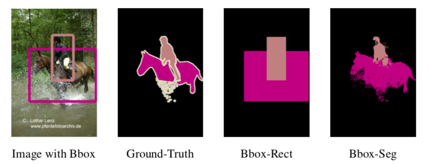
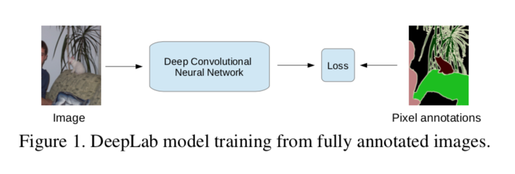
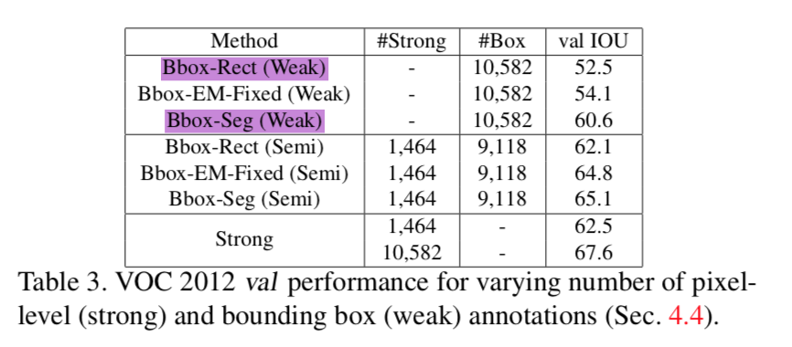
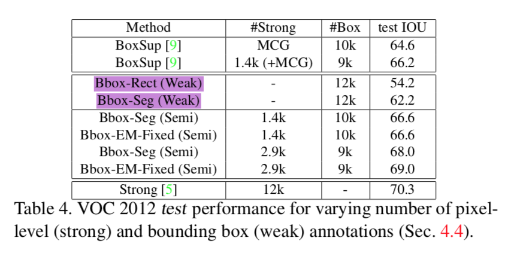
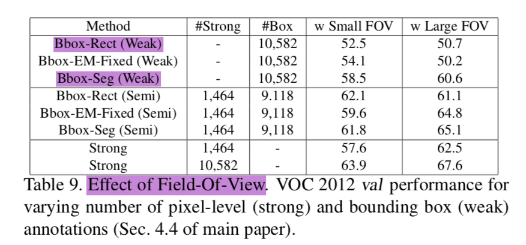

# 论文阅读笔记：Weakly- and Semi-Supervised Learning of a Deep Convolutional Network for Semantic Image Segmentation

## Introduction
基于弱监督和半监督学习的图像语义分割，代码实现基于deeplab v1而来。该笔记主要介绍基于bounding box的弱监督学习。

## BBox-Rect and BBox-Seg
### 数据集获取
* BBox-Rect
将bounding box外全部当作背景，bbox里面则为相应类别的前景，如果两个bbox重叠，则该区域像素类别属于bbox面积小的类别。
* BBox-Seg
根据上面的思路，bbox外全部是背景，bbox里面的（20%像素占比）为相应类别的前景，其余（80%）为不确定区域。最后用这个结果+DenseCRF得到proposals。

注：[官方release的数据集](http://liangchiehchen.com/projects/Datasets.html)

### Framework

主要是基于deeplab v1的监督学习图像语义分割。
在训练阶段，输入一张图像（$W*H*C$），经过DCNN（VGG16，3次2倍下采样，最后下采样8倍），输出feature maps（$W_{downsample}*H_{downsample}*C$）,最后对ground truth进行下采样成和feature maps相同大小（最邻近插值），计算softmax交叉熵损失，反向传播DCNN，训练网络。
在测试阶段，对DCNN预测的feature maps进行上采样（8倍，双线性插值），恢复成原图大小，经过softmax之后在使用DenseCRF做后处理。

## Experiments
## Pascal VOC12

在验证集上的结果，训练集10582。

在测试集上的结果，训练集为10582+1449。

不同backbone的结果。
## Details
### Train and test
在训练阶段，图像输入大小为321*321，对于小于321*321的图像，在下边和右边进行padding，使用均值填充。对于大于321*321的图像，则进行随机裁剪。
在测试阶段，图像输入大小为513*513，因为pascal voc12的图像均小于513，最后在从左上到右下裁剪成原图大小。

### Backbone
DeepLab_LargeFOV的VGG16模型在Conv5-1到Conv5-3 kernel=3*3，dilation=2，stride=1，padding=2。fc6，kernel=3*3，dilation=12，stride=1，padding=12，channel=1024。fc7，kernel=1*1，stride=1，padding=0，channel=1024。Conv4-3后和Conv5-3的max pooling，kernel=3*3，stride=1，padding=1。Conv5-3的max pooling后加了一层average pooling。
VGG16在ImageNet的1000类上训练过，最后再把1000类换成21类。

### Learning Policy
使用SGD+Momentum(0.9)，batch size=20，learning rate 初始为0.001(fc8层为0.01)，weight decay=5e-4，每2000次迭代学习率衰减10倍，共训练6000次迭代。

## Summary
代码很solid，实验结果经过复现，与论文一致。Good！

